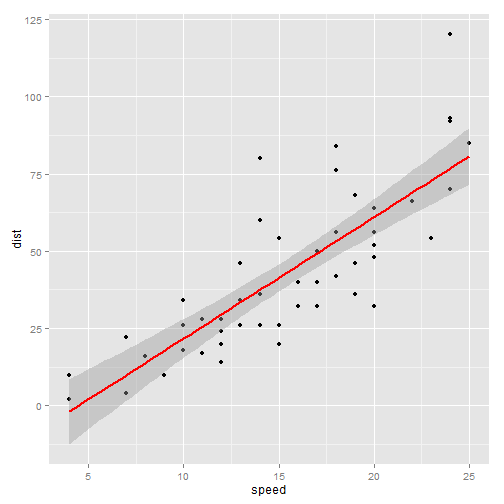
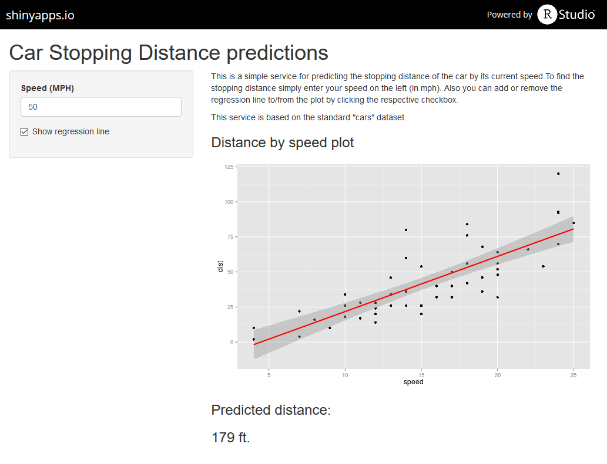

Car Stopping Distance Prediction
========================================================
author: Nikolay Chervyakov
date: November 22, 2015

Introduction
========================================================

Now that we have many freely available datasets we can make predictions in different areas. Here we will:
* predict the car stopping distance by its speed
* draw a plot of our dataset

Used dataset
========================================================

For predictions we will use the **cars** dataset. Here it is:


```r
library(datasets)
data(cars)
summary(cars)
```

```
     speed           dist       
 Min.   : 4.0   Min.   :  2.00  
 1st Qu.:12.0   1st Qu.: 26.00  
 Median :15.0   Median : 36.00  
 Mean   :15.4   Mean   : 42.98  
 3rd Qu.:19.0   3rd Qu.: 56.00  
 Max.   :25.0   Max.   :120.00  
```

Plot
========================================================

Our service outputs a plot with a regression line.

 

Interface
========================================================




